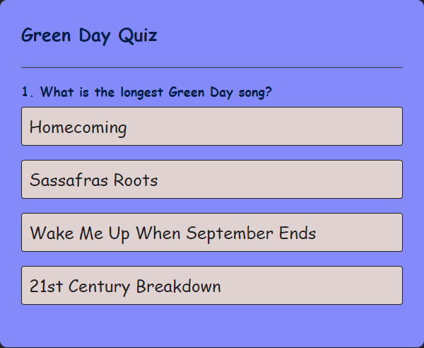
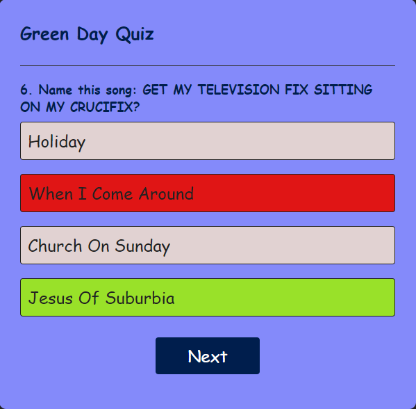
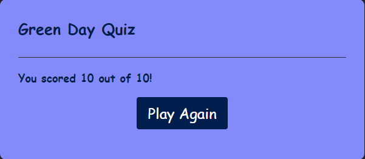
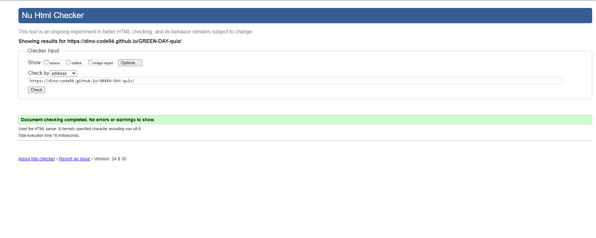
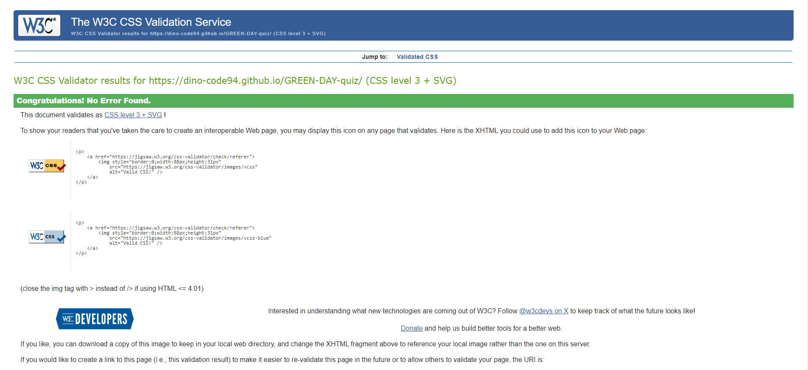
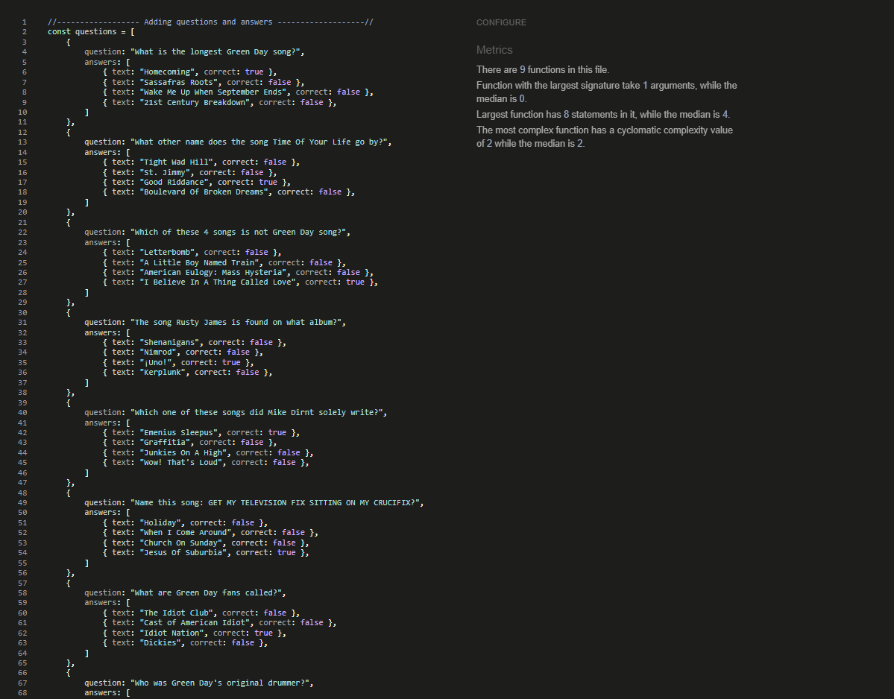

# GREEN DAY quiz

   - This web quiz is about God’s favorite band Green day

   - This web quiz contains numbers of simple question about Green day

   - With this web quiz I didn't target a specific audience like old fans or hard core Green Day fans,
     this web quiz is for all kinds of people, so the idea was to keep it very simple, 
     the quiz contains 10 questions and they are very easy, I didn't go into their old staff,
     questions are about popular songs, so that player can go through and maybe learn something new about them, become a new fan or just have some fun.

   

## Features

### Existing Features

- __Main__

   - Main layout contains Quiz name
   - Main layout contains first question with four options

- __Next button__

  - Next button is hidden until player select answer
  - Once answer selected next button will appear

- __Correct and incorrect__

  - Once player select correct answer option field will be green, if answer is incorrect field is red
 

- __Score__

  - Player score will appear at the end of the quiz
 

- __Play again__

   - Play again button is display an the end of the game
   - Play again button will reset the quiz
 

## Typography 

   - I used the font family called - `"Playpen Sans" cursive`, font that emulate handwritingg
   - I uset font size x-large
   
## Colour Scheme
  
   - `#232224`, used for body background
   - `#848afa`, used for app
   - `#333`, used for app, h1, border-bottom
   - `#001e4d`, used for next-btn background
   - `#fff`, used for next-btn color
   - `#99e129`, ised for correct answer
   - `rgb(224 21 21)`, used for incorrect answer

## Tools & Technologies
- [HTML](https://en.wikipedia.org/wiki/HTML) used for main structure and content.
- [CSS](https://en.wikipedia.org/wiki/CSS) layout and desing.
- [GIT](https://git-scm.com) version control system (Git add , Git commit and Git push).
- [JavaScript](https://simple.wikipedia.org/wiki/JavaScript) used for responsive layout
- [GitHub](https://github.com) used for - create, change, merge, and collaborate with files and code.
- [GutHub Pages](https://pages.github.com) used for hosting the page.
- [VsCode](https://code.visualstudio.com/) used for operations like debugging, task running, and version control

## Testing

## Code Validation

### HTML

I have used the recommended [HTML W3C Validator](https://validator.w3.org/) to validate HTML

| Report | Screenshot |
| :---: | :---: |
| index.html |  |

### CSS

I have used the recommended [CSS Jigsaw Validator](https://jigsaw.w3.org/css-validator/) to validate all of my CSS files.

| Report | Screenshot |
| :---: | :---: |
| style.css |  |

### JavaScript

Bellow is the recommended [JSHint](https://jshint.com/) results

| Report | Screenshot |
| :---: | :---: |
| script.js |  |

## Manual testing

   - I have tested the desktop and mobile version of the website with Chrome, Firefox and Edge on a Windows Computer.
   
   - I have tested the mobile version with Chrome and Firefox on an android device.
   
   - I have shared the website with multiple users to confirm the website functionality on different devices and to get feedback on their experience.
   
   - I have tested all the links on the website.

## Credits

### Content

  - All of the content was my personal knowledge about Green day , with little online research, google, youtube, and Green day pages.

## Deployment

- The site was deployed to GitHub pages as follows:

 - In the GitHub repository, navigate to the Settings tab
 - Open the "Pages" page in the sidebar
 - From the source section drop-down menu, select the Main Branch
 - Once the Main branch has been selected, the page will be automatically refreshed with a detailed ribbon display to indicate the successful deployment.

The live link can be found here: https://dino-code94.github.io/GREEN-DAY-quiz/
  

   

   

    
   

 
 
